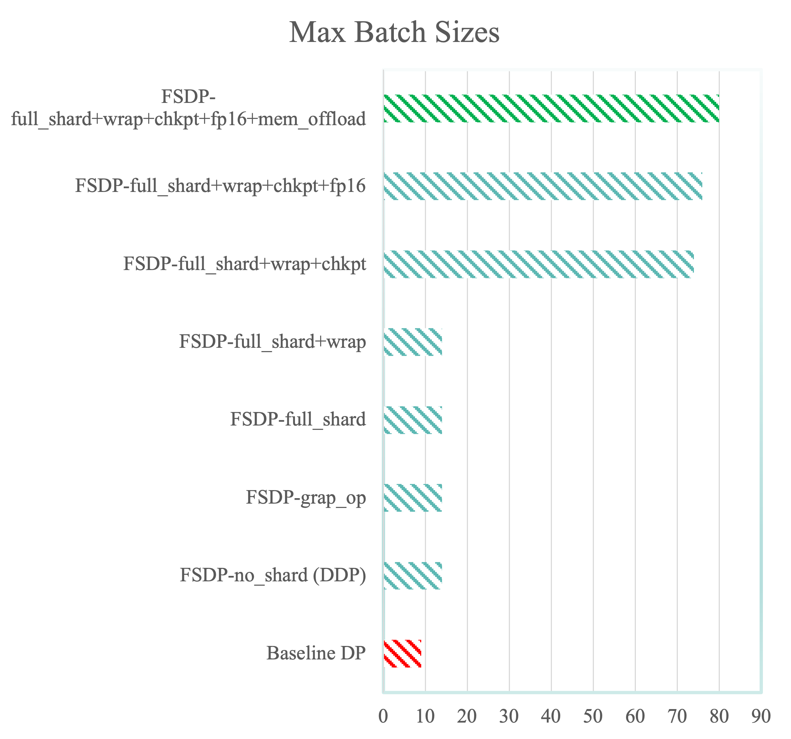
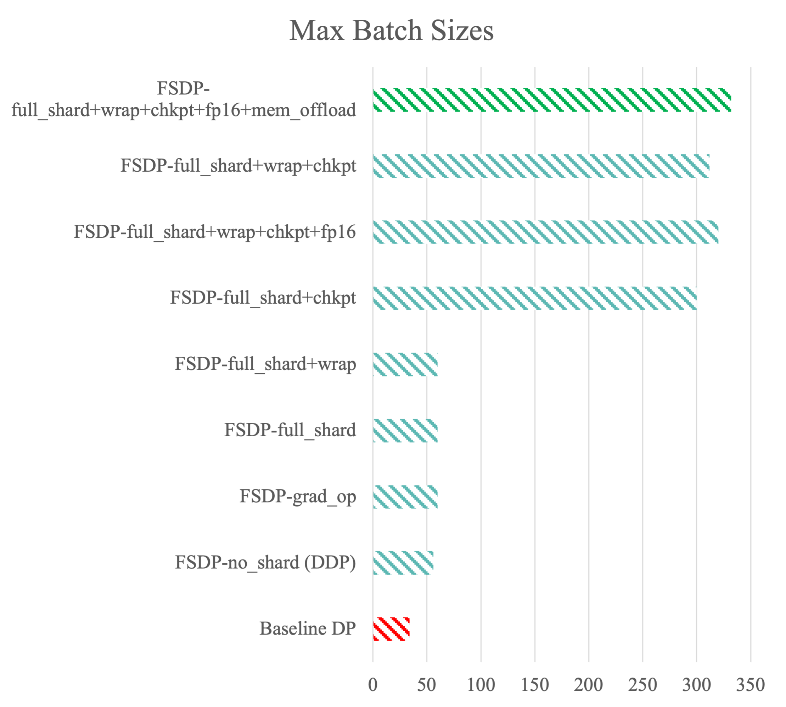

# Fully-Sharded Data Parallel Transformer-XL

This repository extends the implementation of Transformer-XL to fully-sharded data parallel.

The original implementation can be found here:
> [Transformer-XL: Attentive Language Models Beyond a Fixed-Length Context](https://github.com/kimiyoung/transformer-xl).

Our implementation focuses on the Pytorch implementation
## PyTorch

- The source code is in the `pytorch/` folder, supporting single-node multi-gpu training via the modules `nn.DataParallel` (original implementation), and `distributed.FullyShardedDataParallel`.
- Please refer to `pytorch/README.md` for details.

## Results

We use 40GB NVIDIA A100 SXM GPUs. We tested with 1 device and 4 devices on a single node. We report the following performace improvements below:

### Single Device FSDP

#### Key Findings:
- FSDP with “no_shard” (DDP), “grad_op” (ZeRO Stage 2) and “full_shard” (ZeRO stage 3) have identical memory footprints. This is because sharding cannot happen on a single device.
- “chkpt” (activation checkpointing) gives the highest boost to the memory footprint, allowing for upto 6x increase in batch.
- “wrap” (wraping decoder layers) and “fp16” together gave a negligible boost to the maximum batch size
- 9x increase in batch size from the baseline

### Multi-device (4) FSDP

#### Key Findings:
- FSDP with “grad_op” (ZeRO Stage 2) and “full_shard” (ZeRO stage 3) have identical memory footprints. This is likely due to the size of the parameter being modest (277Mn), so sharding it does not give significant memory gain
- “chkpt” (activation checkpointing) gives the highest boost to the memory footprint, allowing for upto 4x batch size.
- “wrap” (wraping decoder layers) does not give a boost when activation checkpointing is not used.
- 10x increase in batch size over baseline
